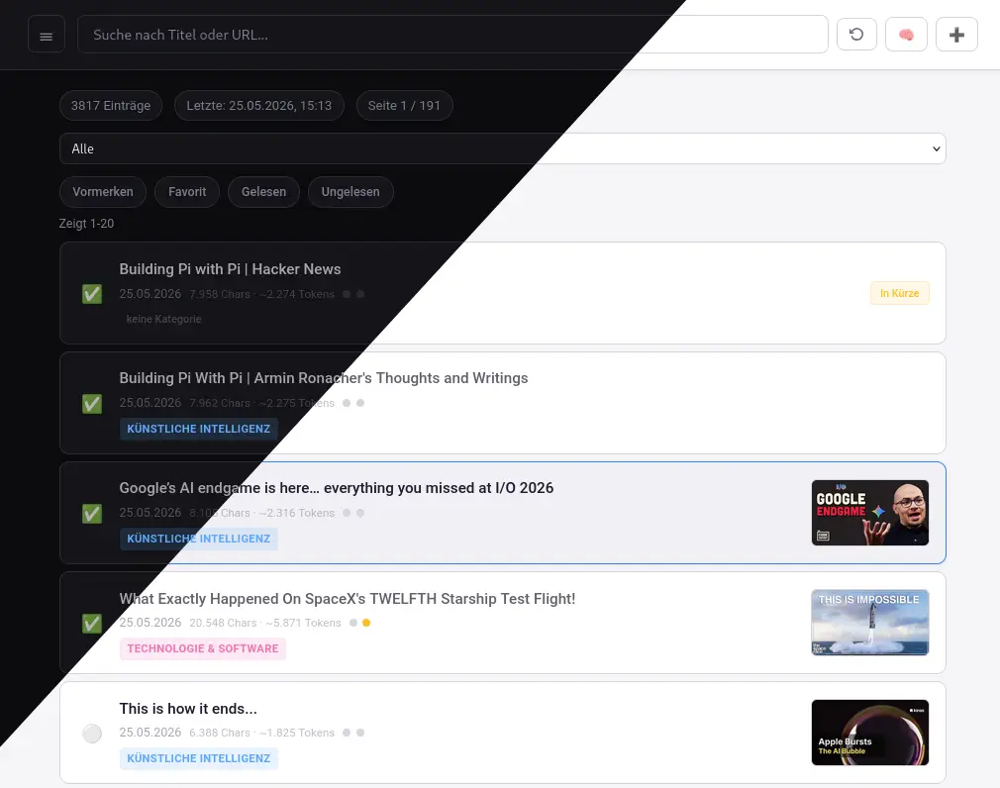

# FoundAItion – Link Collection & AI Summarizer



A **single-binary web application** for collecting, managing, and summarizing links with AI. Built with Go – no npm, no Docker, no external runtime required.

## Features

- **Link management** – Add, browse, search, filter, edit, and delete links
- **Web crawling** – Built-in crawler (Colly) extracts page content as Markdown
- **YouTube support** – Automatic thumbnail display, playlist support, subtitle/Whisper transcription
- **AI summaries** – Generate summaries via any OpenAI-compatible API (GPT, Claude, local LLMs)
- **Local LLM support** – Use [LiteLLM](https://github.com/BerriAI/litellm) or [llama.cpp](https://github.com/ggml-org/llama.cpp) server as drop-in replacements – just set `OPENAI_BASE_URL` to your local endpoint
- **Bilingual UI** – Deutsch & English, switchable at runtime
- **Categorization** – Auto-categorize entries using a separate (faster) model, language-aware
- **Smart filtering** – By category, bookmark/favorite/read status, full-text search
- **Read tracking** – Mark articles as read/unread directly from the list view
- **RSS/Atom feed** – `/rss` endpoint with action links for automation
- **SQLite** – Local storage, no database server needed
- **Dark/Light mode** – Switchable theme, respects system preference

## Quick Start

```bash
# Build from source
git clone <your-repo>
cd foundaition
go build -o foundaition

# Configure
cp .env.example .env
# Edit .env with your OpenAI API key

# Run
./foundaition
# → http://localhost:8080
```

## Requirements

- **Go ≥ 1.23** for building
- **OpenAI API Key** (or compatible) for AI summaries
- **yt-dlp** (auto-installed) + **Whisper** (optional) for YouTube transcription

### Local Processing

Instead of OpenAI, you can point FoundAItion to any OpenAI-compatible backend:

- **[LiteLLM](https://github.com/BerriAI/litellm)** – Proxy for 100+ LLM providers (local & cloud)
- **[llama.cpp](https://github.com/ggml-org/llama.cpp)** – Run local GGUF models with its built-in OpenAI-compatible server

Set `OPENAI_BASE_URL` to your local endpoint (e.g. `http://localhost:1234/v1`).

### Whisper

For YouTube transcription, FoundAItion supports the standard OpenAI Whisper API. A lightweight, ready-to-run proxy is available at:

👉 **[WhisperAPIProxy](https://github.com/ei23fxg/WhisperAPIProxy)** – Docker-based Whisper server with OpenAI-compatible API

## Documentation

See [manual_DE.md](manual_DE.md) for full documentation (German) or [manual_EN.md](manual_EN.md) (English).

## License

Copyright (C) 2026 ei23

This program is free software: you can redistribute it and/or modify
it under the terms of the **GNU General Public License** as published by
the Free Software Foundation, either version 3 of the License, or
(at your option) any later version.

This program is distributed in the hope that it will be useful,
but WITHOUT ANY WARRANTY; without even the implied warranty of
MERCHANTABILITY or FITNESS FOR A PARTICULAR PURPOSE. See the
GNU General Public License for more details.

You should have received a copy of the GNU General Public License
along with this program. If not, see <https://www.gnu.org/licenses/>.
